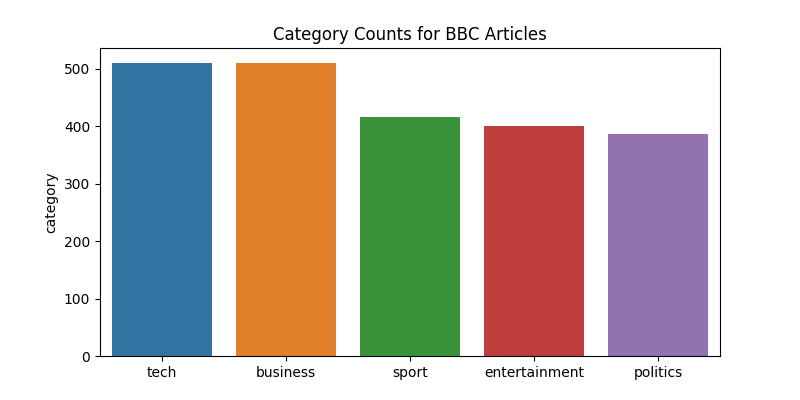
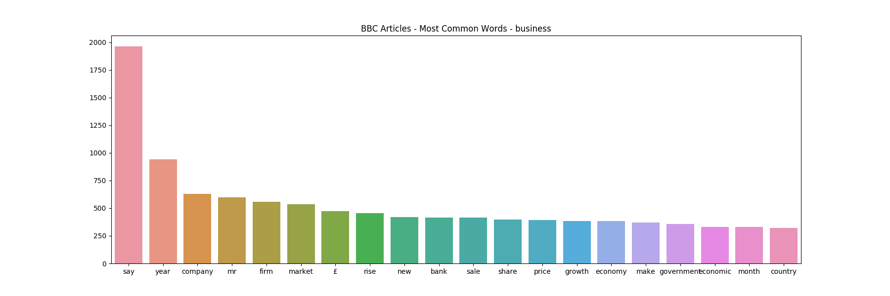
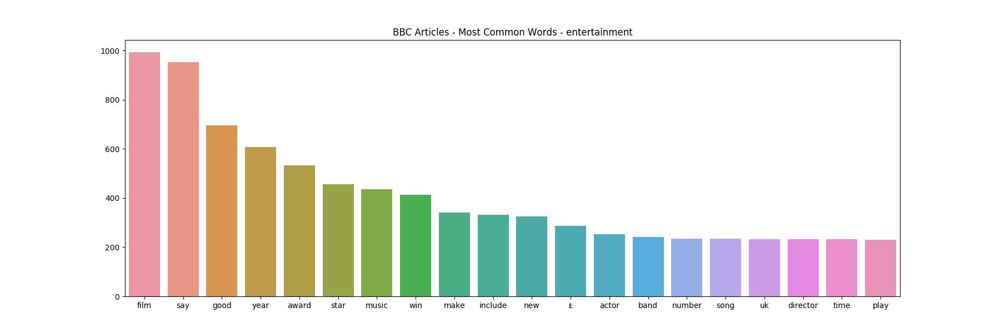
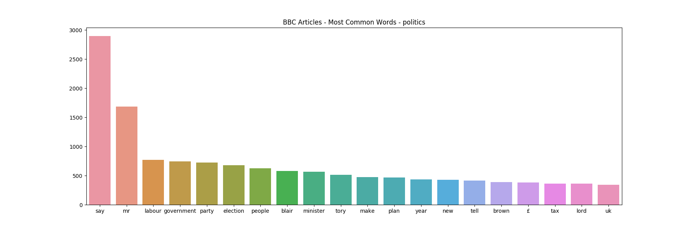
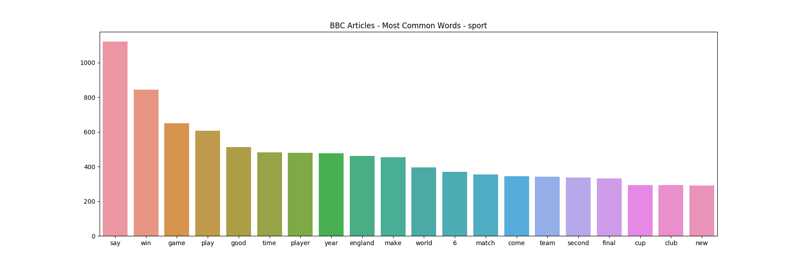
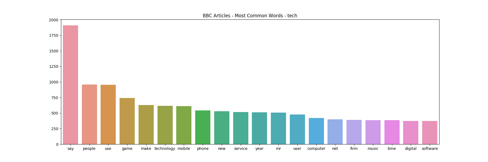

# Text Categorization

## Purpose
I want to categorize news articles using machine learning. To do so, I'm going to:
* tokenize the text using Spacy so that I can clean out the punctuation and stopwords and just have the lemmas (e.g. stems or root word)
* compare the results from scikit-learn's MultinomialNB and LinearSVC when testing and training a model to categorize articles
* look for ways to evaluate the models

## Process
Before categorizing the text, I want to get a better idea of what kind of data I'm working with.

First, let's see a breakdown of the category counts throughout the whole dataset to see how evenly represented the categories are - or not.



Next, I'm curious what the most commonly used words are in each category. Right now, I'm just going to use unigrams when tokenizing, but I'm wondering if seeing the most common words might point out the need to use bigrams. Also, it would be interesting to know whether tf-idf may increase accuracy by downscaling the importance of words that appear too often to be useful.

### Most Common Words by category






A few things jumped out after looking at the top 20 words in each category:
* The word 'say' came in either first or second for all categories, often by a huge margin compared to the next word
* The British pound symbol showed up in 3 of the categories
* The words 'new', 'year' and 'make' also all appeared in the top 20

As a result, I'd like to see how the classifiers compare with 'say' and the pound symbol removed. For now, I'll leave the other three words alone since their ranks are spread out fairly evenly amongst the categories.

#### Metrics using sklearn's MultinomialNB:
```
               precision    recall  f1-score   support

         tech    0.98844   0.94475   0.96610       181
     business    1.00000   0.93023   0.96386       129
        sport    0.91852   0.99200   0.95385       125
entertainment    0.99371   1.00000   0.99685       158
     politics    0.95270   0.99296   0.97241       142

    micro avg    0.97143   0.97143   0.97143       735
    macro avg    0.97067   0.97199   0.97061       735
 weighted avg    0.97281   0.97143   0.97145       735
```

#### Metrics using sklearn's MultinomialNB with a TF-IDF Transformer:
```
               precision    recall  f1-score   support

         tech    0.97175   0.95028   0.96089       181
     business    1.00000   0.89922   0.94694       129
        sport    0.89855   0.99200   0.94297       125
entertainment    0.98137   1.00000   0.99060       158
     politics    0.96503   0.97183   0.96842       142

    micro avg    0.96327   0.96327   0.96327       735
    macro avg    0.96334   0.96267   0.96196       735
 weighted avg    0.96503   0.96327   0.96323       735
```

Surprisingly, adding tf-idf to the pipeline actually slightly hurt the results. Now I'm curious how blacklisting 'say' and the pound symbol affect the results.

#### Metrics using sklearn's MultinomialNB - blacklisted 'say' and pound symbol:
```
               precision    recall  f1-score   support

         tech    0.98844   0.94475   0.96610       181
     business    1.00000   0.93023   0.96386       129
        sport    0.91852   0.99200   0.95385       125
entertainment    0.99371   1.00000   0.99685       158
     politics    0.95270   0.99296   0.97241       142

    micro avg    0.97143   0.97143   0.97143       735
    macro avg    0.97067   0.97199   0.97061       735
 weighted avg    0.97281   0.97143   0.97145       735
```

#### Metrics using sklearn's MultinomialNB with a TF-IDF Transformer - blacklisted 'say' and pound symbol:
```
               precision    recall  f1-score   support

         tech    0.97175   0.95028   0.96089       181
     business    1.00000   0.90698   0.95122       129
        sport    0.90511   0.99200   0.94656       125
entertainment    0.98137   1.00000   0.99060       158
     politics    0.96503   0.97183   0.96842       142

    micro avg    0.96463   0.96463   0.96463       735
    macro avg    0.96465   0.96422   0.96354       735
 weighted avg    0.96614   0.96463   0.96460       735
```

Yet another surprise: blacklisting 'say' and the pound symbol barely made a difference and only when tf-idf was being used.

I'm going to switch classifiers now and swap out MultinomialNB for LinearSVC to see how they compare:

#### Metrics using sklearn's LinearSVC:
```
               precision    recall  f1-score   support

         tech    0.95531   0.94475   0.95000       181
     business    0.96094   0.95349   0.95720       129
        sport    0.94400   0.94400   0.94400       125
entertainment    0.97531   1.00000   0.98750       158
     politics    0.96454   0.95775   0.96113       142

    micro avg    0.96054   0.96054   0.96054       735
    macro avg    0.96002   0.96000   0.95997       735
 weighted avg    0.96046   0.96054   0.96045       735
```

#### Metrics using sklearn's LinearSVC with a TF-IDF Transformer:
```
               precision    recall  f1-score   support

         tech    0.97727   0.95028   0.96359       181
     business    0.99206   0.96899   0.98039       129
        sport    0.93077   0.96800   0.94902       125
entertainment    0.98750   1.00000   0.99371       158
     politics    0.97902   0.98592   0.98246       142

    micro avg    0.97415   0.97415   0.97415       735
    macro avg    0.97333   0.97464   0.97383       735
 weighted avg    0.97450   0.97415   0.97418       735
```

The combination of LinearSVC and tf-idf has so far been the best performer. Later though, just for kicks, I added the blacklists back in and they ended up producing an additional bump, both with and without tf-idf.

#### Metrics using sklearn's LinearSVC - blacklisted 'say' and pound symbol:
```
               precision    recall  f1-score   support

         tech    0.95531   0.94475   0.95000       181
     business    0.96094   0.95349   0.95720       129
        sport    0.95200   0.95200   0.95200       125
entertainment    0.96914   0.99367   0.98125       158
     politics    0.96454   0.95775   0.96113       142

    micro avg    0.96054   0.96054   0.96054       735
    macro avg    0.96038   0.96033   0.96032       735
 weighted avg    0.96049   0.96054   0.96047       735
```

#### Metrics using sklearn's LinearSVC with a TF-IDF Transformer - blacklisted 'say' and pound symbol:
```
               precision    recall  f1-score   support

         tech    0.97740   0.95580   0.96648       181
     business    0.99206   0.96899   0.98039       129
        sport    0.93798   0.96800   0.95276       125
entertainment    0.98750   1.00000   0.99371       158
     politics    0.97902   0.98592   0.98246       142

    micro avg    0.97551   0.97551   0.97551       735
    macro avg    0.97479   0.97574   0.97516       735
 weighted avg    0.97575   0.97551   0.97553       735
```

## TODO
* Do text classification spacy

## Local Development
Run `docker-compose up` in the project root to launch a run a Python container that includes all of the dependencies, which can be found in `.docker/requirements.txt`. I downloaded the Spacy model in the dockerfile so that I didn't need to do it manually later on.
